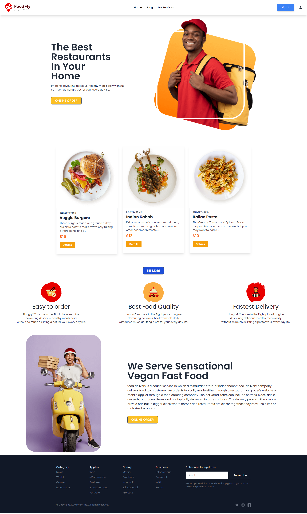

# Welcome to our Website ---- FoodFly

WebSite  [Live Link]...
or...() Livelink


WebSite Courses
## Details about our Website..
### How this website  was built?
> * This is Website in create a React js or create-React-App
> * This is Website second item in React Router
> * Use Taliwind CSS For Styles and mamba ui, kitwind ui kit, componets used in website
> * I have alert to used react sweetalert2
> * I have used setup  data sent components in context api
> * Used You website in Header,Statistics,error And Footer


### what is the learn of website?
> * website A poroper service Home delivery
> * About delivery service  and online delivery
> * The specific  online Food delivery services

| # setup:

Fork [main]branch into your personal repository.
```
$ git clone 
$ npm install or npm i
$ npm run build  
$ npm start or npm run start
```

# Develop

Created By on The WEB DEVELOPER MD.NAIMUL ISLAM

.

.


